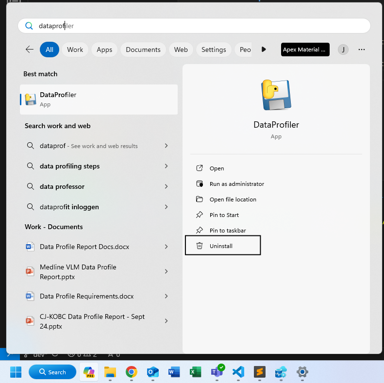

# *DataProfiler* Standard Operating Procedure

## About

*DataProfiler* is sort of the "home base" of data analysis for Apex Consulting. Its main functionality is the ability to upload client data files to the database, at which point the data can be loaded into the Data Profile Report.

## Terms

### Data directory 

a folder with client data files. The folder should contain ALL files the user wishes to upload. See below for naming conventions:  

```   
ItemMaster.csv  
InboundHeader.csv  
InboundDetails.csv  
Inventory.csv  
OrderHeader.csv  
OrderDetails.csv 
```

> File names need to *EXACTLY* match what is listed above  

Item Master is the only required file. Otherwise, the files given should match the "Process __ Data" options chosen on the "Upload Data" screen. For eample, if "Process Inbound Data" is set to true, both Inbound Header and Inbound Details must be present. Otherwise, neither are required and neither will be uploaded  

  
*Data directory with no inbound data. "Process Inbound Data" should be set to false*  

  
*Data directory with all files present. All "Process __ Data" flags can be set to true, or only the ones you prefer. Notice also that other files can be present in the data directory - they will be ignored.*  

## Installation

1. Acquire the EXE Installer for DataProfiler from IT or an analyst

2. Reach out to IT for two things:  
    - Getting connected to the "Y" drive  
    - Access to the database

3. Find the EXE installer in File Explorer


4. Double-click the installer file, and click through the wizard  
    - Select "Create a desktop shortcut" if you'd like a shortcut  

5. When prompted, click "Install"  
      
    - The installation shouldn't take more than 30 to 60 seconds

6. Click "Finish" to complete


## Startup

There are a few options for starting up the *DataProfiler* application

1. Double-click your desktop shortcut, if you opted to create one  

2. In the windows search bar, start typing "DataProfiler" until the app appears, at which point you can click the icon  
  


## Using the application

1. The application may take a minute to start up, especially if this is the first usage in a few hours or more. This is because the database connection takes a moment to "warm up"    
    - If the startup fails because the database connection fails, or if it fails at any point due to this error, simply close the app and re-start it. Once the connection is established, it should run smoothly and quickly  

2. You will be greeted by the following window. As it prompts, either select an existing project number from the dropdown or click the orange button with the "+" icon to create a new one  
    - This application is *NOT* connected to Business Central, and these "projects" are specifically "data projects." So, for this app, a project doesn't exist until you create one using this tool, even if it exists in BC    


3. Let's create a new project. Click on the orange button with the "+" icon  

4. We're brought to the new project form. Enter the new project number and related information, including some notes about the project and its data    
    - Be sure to include some good notes, as they can be very helpful for posterity. Some things to include may be the scope of the project, the date range of the data, and any note-worthy data cleaning done on the data  
    
  

5. Click the orange button with the checkmark icon to create the project  
    - If there are any errors with your inputs, make necessary corrections and try again  

6. If successful, you will be brought to the project dashboard, and notified by a pop-up window of the success  
    - On this page, you will see the project info you just entered as well as information about the project's data  
    
  

7. Currently, there is no project data, so no information appears. To upload some data, click the orange button with the upload icon in the bottom right  

8. Complete the form to upload data  
    - Click "Browse" and select the folder where the client data is stored  
    - Choose desired options for dealing with dates  
    - Select which data files should be processed  
    - Click the orange button with the checkmark icon to submit and upload  
    
  

9. If successful, the app will navigate back to the project dashboard and display another pop-up window notifying of success  
    - Check the statistics listed in the pop-up window and ensure they look correct. Number of SKUs, outbound lines, etc.  
    - Click "Open Log" and read through the log file to ensure the data transformation and upload went smoothly. Any errors will be expounded upon in more detail here  
        - It may be useful to keep log files around. They are saved to Downloads, so navigate there in File Explorer and store in your project folder  
        - Click "Close" to close the pop-up  
    - Note that now, info about the project data appears on the right side  
    
  


> *Notice* that the entry boxes on the left side of the home screen are active and editable, whereas the entries on the right side are not. Project Info can be changed in the dashboard, and saved by clicking the light blue button in the bottom left. Project *Data* Info cannot be changed here, as it describes data stored in the database  

10. Try updating some project info. You may add some notes after uploading the data. Click the blue button to save, and "Yes" to confirm    
  

11. While you cannot change Project Data Info in the dashboard, you can delete the project's data. To do so, click the gray button with the trash can icon in the bottom right  
    - This may be necessary if you receive some new data cleaning directive or if you'd like to choose different upload options  
    - Otherwise, it is rarely advisable to delete project data  
    
  

12. Once again, if successful, you will be notified with a pop-up window and a button to open a log file  
    - Be sure to browse the log file to ensure everything went smoothly  
    - Notice that the data info has disappeared from the right side of the dashboard  

  

13. From here, you could upload a new data set, or the same one with new options by following steps 7-9 another time  

14. The final functionality is to delete a project. This is not really ever advisable, but can be done by clicking the trash can icon in the top right, and clicking "Yes" to confirm  
    - If successful, you will be navigated back to the start page  

  


## Updating to a new version

Periodically, updates to *DataProfiler* may be released. At such times, you should be notified by IT or an analyst of the new version and will be asked to update your app.  

The following pop-up window will also appear on start-up when the application is out-of-date    
   
> Promptly updating will be important, as the application will stop working once it becomes an out-of-date version 

To update your version, you will need to 1) uninstall your current app and 2) install the new

1. Search for the application in the windows search bar, but click "Uninstall" rather than starting up the app  
  

2. This will navigate you to the "Installed Apps" section of Settings. Scroll down to find your installed version of *DataProfiler*. Click the ellipsis on the far right of its rectangle, and click "Uninstall." Confirm by clicking "Uninstall" again, and then "Yes"  
  

3. If successful, click "OK" to confirm, and your app is deleted  

4. Acquire the EXE installer for the new version of *DataProfiler*, either from IT or an analyst. 

5. Follow the remaining steps from <a href="#installation">Installation</a>  